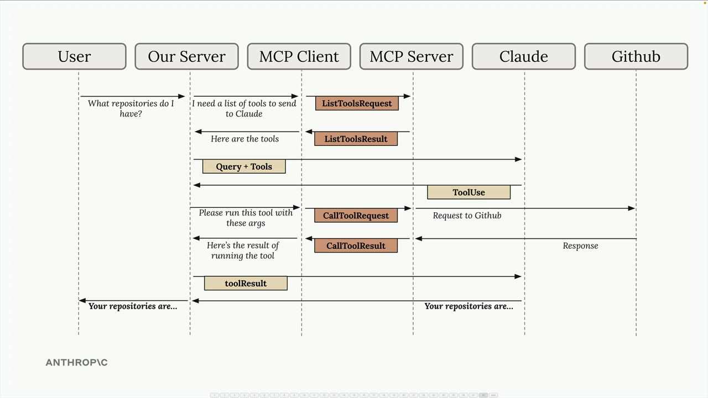
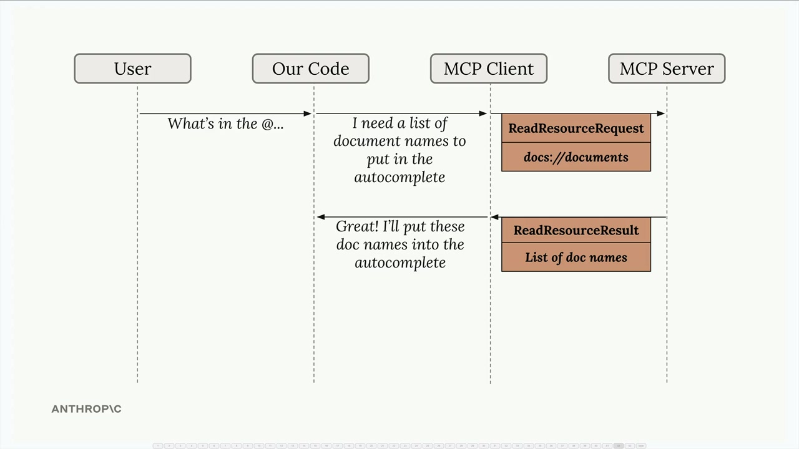

# Model Context Protocol (MCP)

It is a communication layer that provides Claude with context and tools without requiring you to write a bunch of tedious integration code. Think of it as a way to shift the burden of tool definitions and execution away from your server to specialized MCP servers.

## How is MCP Different from Direct API Calls?

MCP servers provide tool schemas and functions already defined for you. If you call an API directly, you're responsible for authoring those tool definitions yourself. MCP saves you that implementation work.

## MCP Request and Response Flow



## MCP Server

Building an MCP server becomes much simpler when you use the official Python SDK. Instead of manually writing complex JSON schemas for tools, the SDK handles all that complexity for you with decorators and type hints.

## MCP Client

Now that we have our MCP server working, it's time to build the client side. The client is what allows our application to communicate with the MCP server and access its functionality.

### Understanding the Client Architecture

In most real-world projects, you'll either implement an MCP client OR an MCP server - not both. We're building both in this project just so you can see how they work together.# Resources

## Resources

Resources in MCP allow your server to expose data that can be directly included in prompts, rather than requiring tool calls to access information. This creates a more efficient way to provide context to AI models like Claude.



### Understanding Resource Requests

When you've defined resources on your MCP server, your client needs a way to request and use them. The client acts as a bridge between your application and the MCP server, handling the communication and data parsing automatically.

## Prompts

Prompts in MCP servers let you define pre-built, high-quality instructions that clients can use instead of writing their own prompts from scratch. Think of them as carefully crafted templates that give better results than what users might come up with on their own.

### Why Use Prompts?

Let's say you want Claude to reformat a document into markdown. A user could just type "convert report.pdf to markdown" and it would work fine. But they'd probably get much better results with a thoroughly tested prompt that includes specific instructions about formatting, structure, and output requirements.

# Running the MCP Server

```bash
mcp dev mcp_server.py
```
